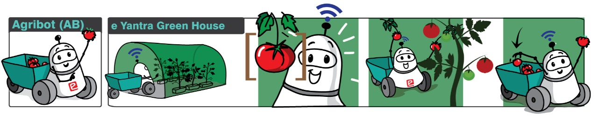

# eYRC-2021_Agribot 

## Welcome the eYRC 2021's  Agri Bot theme !!!


>Note: This is an official repository for the Agri Bot theme, e-Yantra Robotics Competition (eYRC 2021-22). All the tasks will be updated as per timeline.



Please find the base package for this theme from this repository.


### Additional Packages

- Install the  ros controller package using following command

  ```shell
  sudo apt-get install ros-noetic-ros-control ros-noetic-ros-controllers
  ```

- "Teleop" package to control `ebot` or any model (all you  would need to do is change the message type, do explore in your spare  time) from your terminal. For those who have install `ros-noetic-desktop-full` don't need to install this package, since it already available.

  ```sh
  sudo apt-get install ros-noetic-teleop-twist-keyboard
  ```

  

### Cloning this repository

Inside your `cakin_ws/src`, enter the following command to clone (download) this repository.

```
git clone https://github.com/erts-RnD/eYRC-2021_Agribot.git
```


